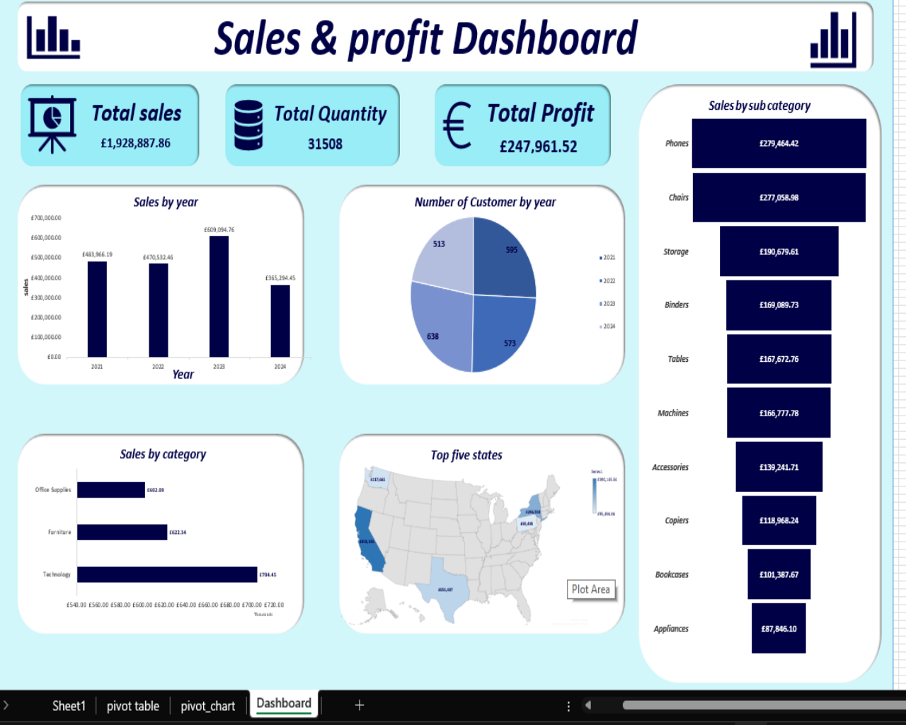

# 📊 Sales & Profit Dashboard | Microsoft Excel

## 📌 Project Overview

This project presents an interactive Sales and Profit Dashboard developed using Microsoft Excel to analyze business performance, sales trends, profitability, and customer insights. The dashboard provides decision-makers with valuable insights to support business growth and strategic planning.

---

## 🎯 Project Objectives

- Analyze sales and profit performance.
- Identify top-performing products and categories.
- Evaluate customer and regional performance.
- Monitor business KPIs and trends.
- Support data-driven decision-making.

---

## 🛠️ Tools & Features Used

- Microsoft Excel
- Pivot Tables
- Pivot Charts
- Slicers
- Conditional Formatting
- Data Cleaning
- Dashboard Design
- Data Visualization

---

## 📊 Key Performance Indicators (KPIs)

- Total Sales
- Total Profit
- Total Orders
- Average Sales
- Top Products
- Top Customers
- Regional Performance

---

# 📈 Dashboard Visualizations

## 📊 Sales & Profit Dashboard

This interactive dashboard provides a comprehensive overview of sales and profit performance across different categories, regions, and customers. It enables users to explore business trends and identify key performance drivers.

### Key Insight:
The analysis identified top-performing products, profitable regions, and sales trends that support strategic business decisions.

---

## 📈 Business Insights

- Identified top-performing products and customers.
- Analyzed sales and profit trends.
- Evaluated regional business performance.
- Highlighted opportunities to improve profitability.
- Generated actionable business recommendations.

---

## 📁 Files Included

- Sales-Profit-Dashboard.xlsx
- Dashboard Screenshots
- README.md

---

## 🎯 Skills Demonstrated

- Data Cleaning
- Data Analysis
- Pivot Tables
- Pivot Charts
- Dashboard Design
- KPI Development
- Business Analysis
- Data Visualization

---

## 👨‍💻 Author

**Mahmoud Gomaa**

Aspiring Data Analyst | SQL | Python | Power BI | Excel# Sales-Profit-Dashboard
